# Obsidian Task Stopwatch Plugin

This is a plugin for Obsidian. This plugin is used for daily work and life.

## Features

### Tasks manager

1. create/delete/cancel tasks
2. tasks classification
   - inbox
   - projects
   - today
   - scheduled
   - completed
   - won't do
3. add tasks from markdown file to inbox

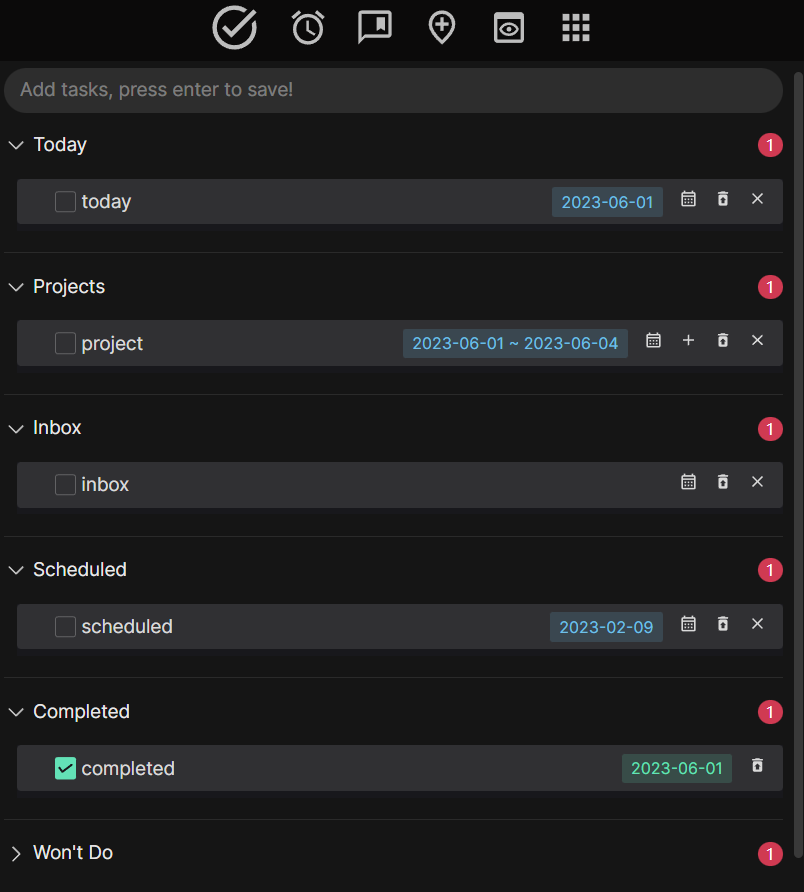

### Tasks stopwatch

1. select task from today or scheduled tasks to focus
2. start/stop/continue/end stopwatch
3. add focus record

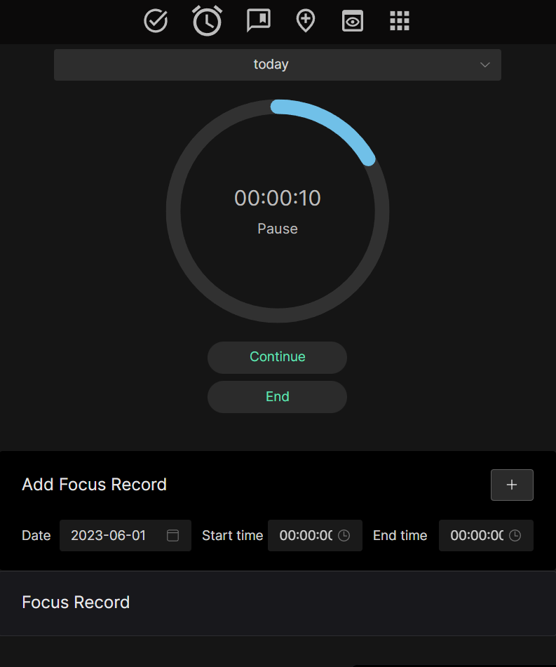

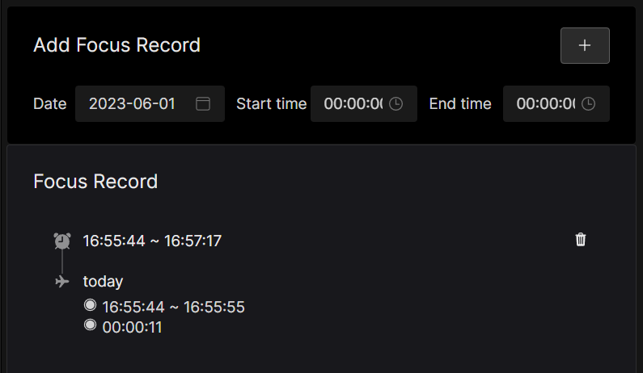

### Bill manager

1. bill classification
2. bill list

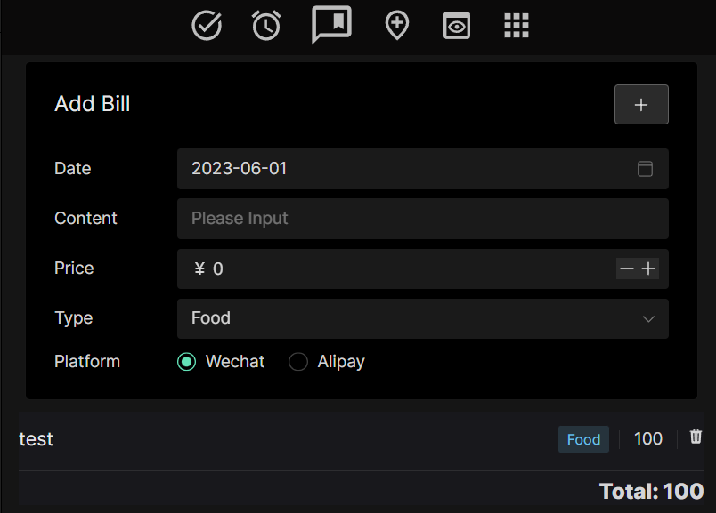

### Habit tracker

1. add habit
2. select repeatition period
3. add habit checkin number 

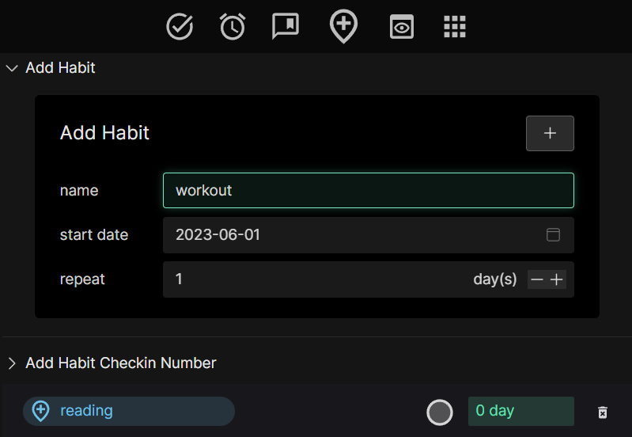

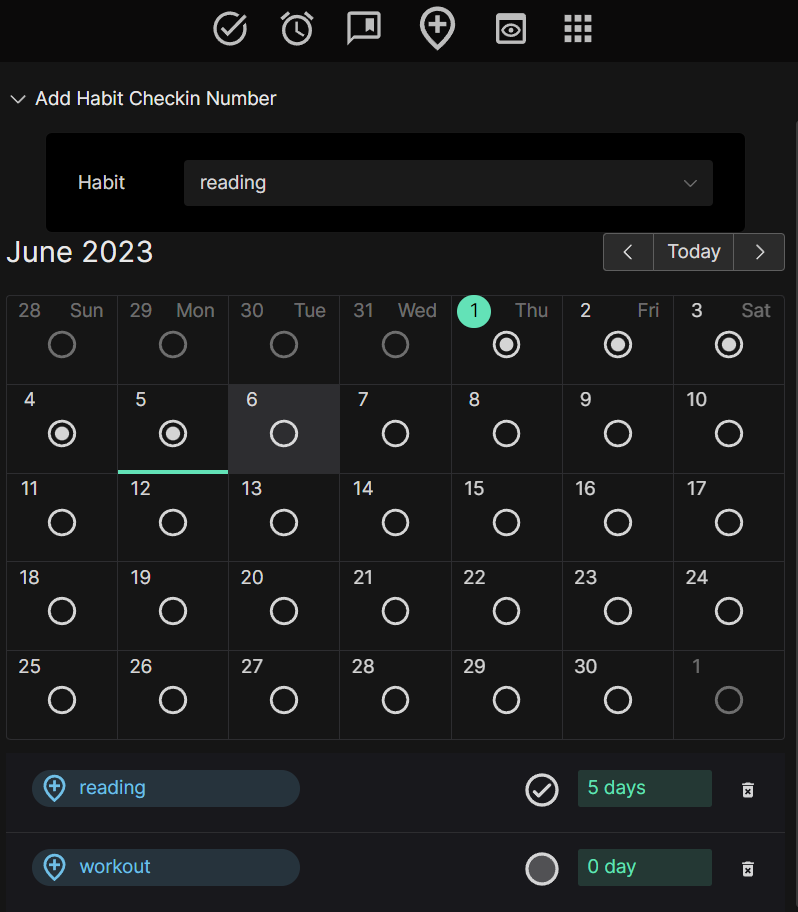

### Daily review

1. weather
2. daily review
   - select date
   - select mood
   - add daily review text

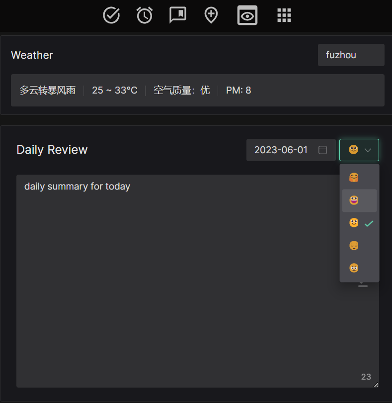

### Data statistics

1. Total completed tasks and focus time
2. focustime heatmap
3. bill line chart
4. bill pie chart
5. habit bar chart
6. mood bar chart
7. year summary
8. save and clear year data

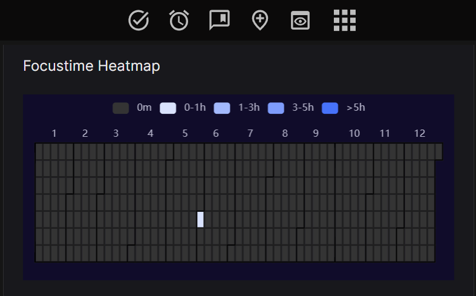

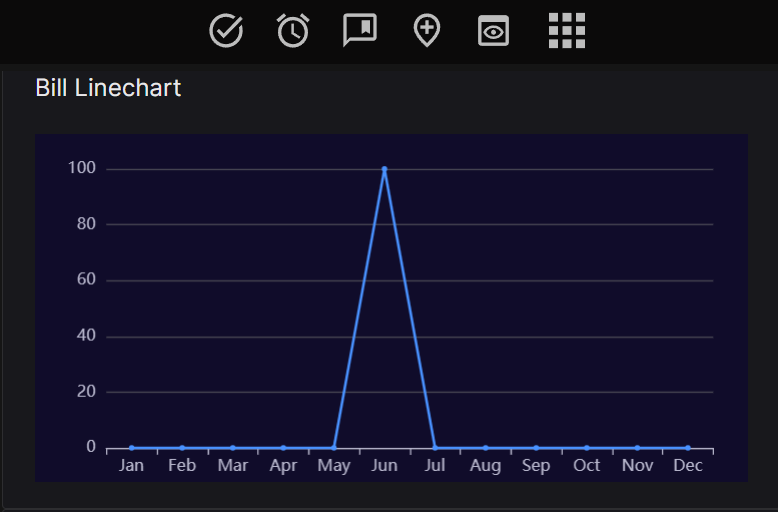

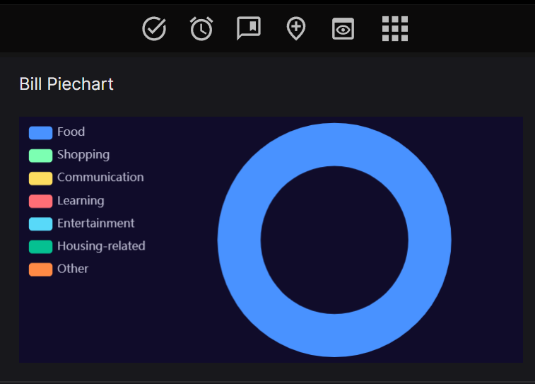

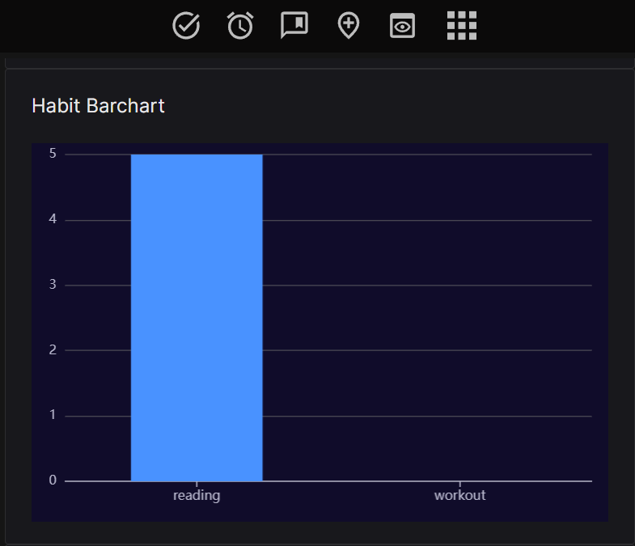

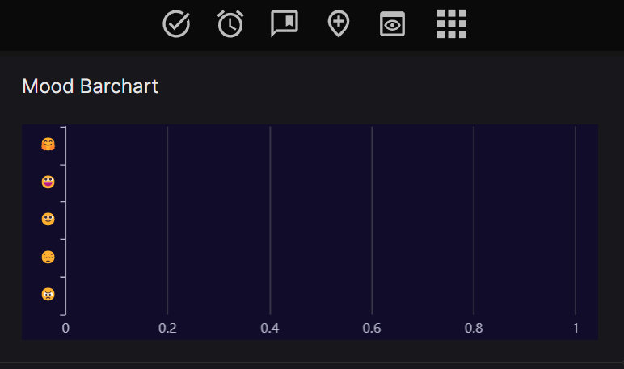

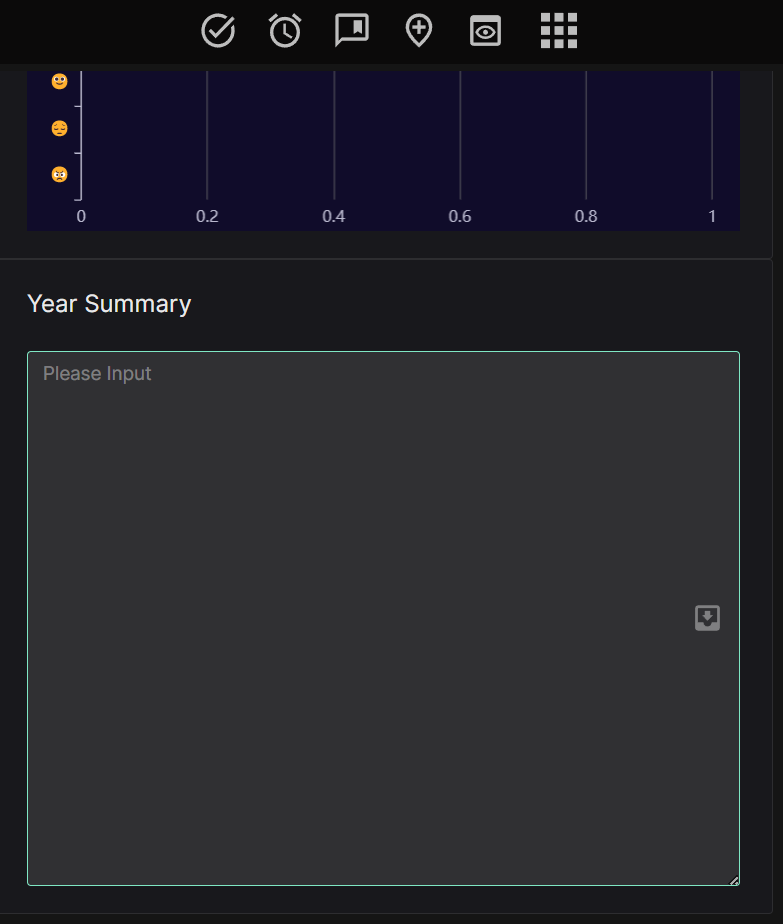

## How to install

Download the latest [release.zip](https://github.com/LeonZ1998/obsidian-daily-manager-plugin/releases/) from Releases page，then put the extracted folder `obsidian-daily-manager-plugin` into your {{obsidian_vault}}/.obsidian/plugins folder.
